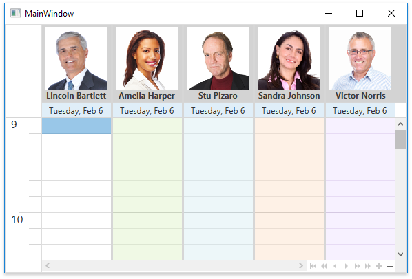

<!-- default badges list -->

<!-- default badges end -->

# WPF Scheduler - Display Custom Text and Images in Resource Headers

This example uses the [SchedulerViewBase.ResourceHeaderContentTemplate](https://docs.devexpress.com/WPF/DevExpress.Xpf.Scheduling.SchedulerViewBase.ResourceHeaderContentTemplate) property to display images and text in resource headers. [Custom Fields](https://docs.devexpress.com/WPF/119962/controls-and-libraries/scheduler/data-binding/custom-fields) allow you to store data source images and bind template properties to them.

## Files to Review

* [MainWindow.xaml](./CS/CustomResourceHeaderExample/MainWindow.xaml)
* [ResourceData.cs](./CS/CustomResourceHeaderExample/Data/ResourceData.cs) (VB: [ResourceData.vb](./VB/CustomResourceHeaderExample/Data/ResourceData.vb))

## Documentation

* [Resources](https://docs.devexpress.com/WPF/119219/controls-and-libraries/scheduler/resources)
* [SchedulerViewBase.ResourceHeaderContentTemplate](https://docs.devexpress.com/WPF/DevExpress.Xpf.Scheduling.SchedulerViewBase.ResourceHeaderContentTemplate)

## More Examples

* [WPF Scheduler - Disable Resource Colorization](https://github.com/DevExpress-Examples/wpf-scheduler-disable-resource-colorization)
* [WPF Scheduler - Customize Cell Colors](https://github.com/DevExpress-Examples/wpf-scheduler-customize-cell-colors)
* [WPF Scheduler - Add DateNavigator and ResourceTreeControl](https://github.com/DevExpress-Examples/how-to-use-scheduler-with-datenavigator-t544898)
<!-- feedback -->
## Does this example address your development requirements/objectives?

 

(you will be redirected to DevExpress.com to submit your response)
<!-- feedback end -->
